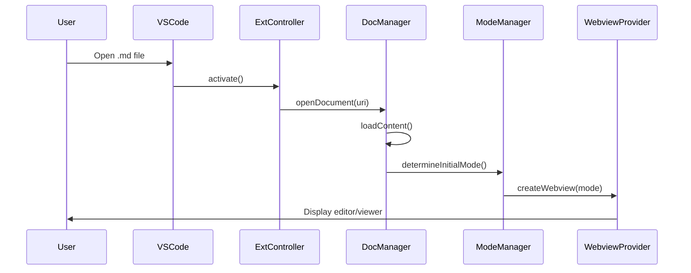
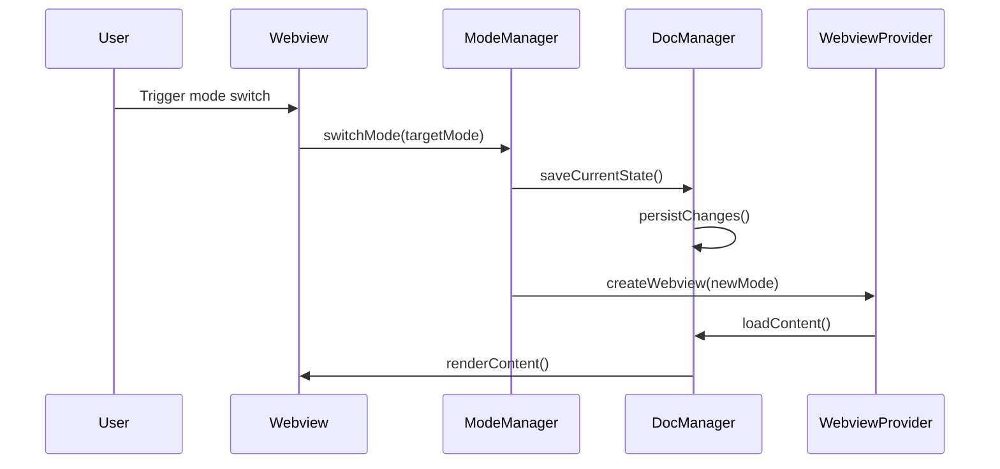
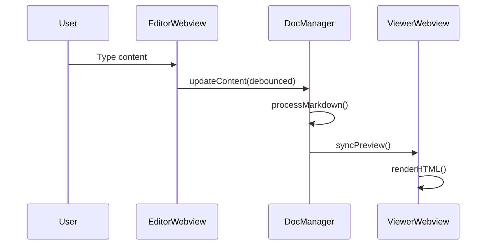

# VS Code Markdown Extension Architecture

## Table of Contents

1. [System Overview](#system-overview)
2. [Architecture Principles](#architecture-principles)
3. [Component Architecture](#component-architecture)
4. [Data Flow](#data-flow)
5. [API Design](#api-design)
6. [State Management](#state-management)
7. [Performance Considerations](#performance-considerations)
8. [Security Architecture](#security-architecture)
9. [Extension Points](#extension-points)
10. [Deployment Architecture](#deployment-architecture)

## System Overview

### High-Level Architecture

```
┌─────────────────────────────────────────────────────────────┐
│                    VS Code Extension Host                   │
├─────────────────────────────────────────────────────────────┤
│                                                             │
│  ┌─────────────────┐  ┌──────────────────┐  ┌─────────────┐ │
│  │   Extension     │  │    Command       │  │  Config     │ │
│  │   Controller    │◄─┤    Manager       │◄─┤  Manager    │ │
│  └─────────────────┘  └──────────────────┘  └─────────────┘ │
│           │                     │                           │
│           ▼                     ▼                           │
│  ┌─────────────────┐  ┌──────────────────┐                 │
│  │   Document      │  │    UI            │                 │
│  │   Manager       │◄─┤    Controller    │                 │
│  └─────────────────┘  └──────────────────┘                 │
│           │                     │                           │
│           ▼                     ▼                           │
│  ┌─────────────────┐  ┌──────────────────┐                 │
│  │   Mode          │  │    Webview       │                 │
│  │   Manager       │◄─┤    Provider      │                 │
│  └─────────────────┘  └──────────────────┘                 │
│           │                     │                           │
├───────────┼─────────────────────┼───────────────────────────┤
│           ▼                     ▼                           │
│  ┌─────────────────┐  ┌──────────────────┐                 │
│  │   Editor        │  │    Viewer        │                 │
│  │   Webview       │  │    Webview       │                 │
│  └─────────────────┘  └──────────────────┘                 │
│                                                             │
└─────────────────────────────────────────────────────────────┘
```

### Technology Stack

**Core Technologies**
- TypeScript 4.9+
- VS Code Extension API 1.74+
- Node.js 16+
- Webpack 5 for bundling

**Frontend Libraries**
- Monaco Editor (WYSIWYG editing)
- Marked.js (Markdown parsing)
- Highlight.js (Syntax highlighting)
- KaTeX (Math rendering)
- Mermaid (Diagram rendering)

**Development Tools**
- ESLint + Prettier (Code quality)
- Jest (Unit testing)
- VS Code Extension Test Runner
- GitHub Actions (CI/CD)

## Architecture Principles

### 1. Separation of Concerns
- Clear separation between editor, viewer, and control logic
- Independent webview contexts for editor and viewer modes
- Modular component design with single responsibilities

### 2. Event-Driven Architecture
- Loose coupling through event-based communication
- Command pattern for user actions
- Observer pattern for state changes

### 3. Performance First
- Lazy loading of heavy components
- Efficient state synchronization
- Minimal DOM manipulation
- Debounced updates for real-time features

### 4. Extensibility
- Plugin architecture for custom features
- Theme system for customization
- Configuration-driven behavior
- Hook system for third-party integrations

## Component Architecture

### Extension Controller

**Responsibility**: Main entry point and orchestration

```typescript
interface ExtensionController {
  activate(context: vscode.ExtensionContext): void;
  deactivate(): void;
  registerCommands(): void;
  registerProviders(): void;
  initializeComponents(): void;
}
```

**Key Functions**:
- Extension lifecycle management
- Component initialization
- Global error handling
- Resource cleanup

### Document Manager

**Responsibility**: Document state and persistence

```typescript
interface DocumentManager {
  openDocument(uri: vscode.Uri): Promise<MarkdownDocument>;
  saveDocument(document: MarkdownDocument): Promise<void>;
  watchDocument(document: MarkdownDocument): vscode.Disposable;
  syncContent(documentId: string, content: string): void;
  getDocumentState(documentId: string): DocumentState;
}

interface MarkdownDocument {
  id: string;
  uri: vscode.Uri;
  content: string;
  isDirty: boolean;
  lastModified: Date;
  metadata: DocumentMetadata;
}
```

### Mode Manager

**Responsibility**: Editor/Viewer mode switching logic

```typescript
interface ModeManager {
  getCurrentMode(documentId: string): EditorMode;
  switchMode(documentId: string, mode: EditorMode): Promise<void>;
  registerModeChangeListener(listener: ModeChangeListener): void;
  canSwitchMode(documentId: string, targetMode: EditorMode): boolean;
}

enum EditorMode {
  EDITOR = 'editor',
  VIEWER = 'viewer',
  SPLIT = 'split'
}
```

### Webview Provider

**Responsibility**: Webview creation and management

```typescript
interface WebviewProvider {
  createEditorWebview(document: MarkdownDocument): Promise<vscode.WebviewPanel>;
  createViewerWebview(document: MarkdownDocument): Promise<vscode.WebviewPanel>;
  updateWebviewContent(panel: vscode.WebviewPanel, content: string): void;
  handleWebviewMessage(message: WebviewMessage): void;
  disposeWebview(panelId: string): void;
}
```

### Command Manager

**Responsibility**: Command registration and execution

```typescript
interface CommandManager {
  registerCommand(command: string, handler: CommandHandler): void;
  executeCommand(command: string, args?: any[]): Promise<any>;
  getAvailableCommands(): string[];
}

interface CommandHandler {
  execute(args?: any[]): Promise<any>;
  canExecute?(args?: any[]): boolean;
}
```

## Data Flow

### Document Loading Flow



### Mode Switching Flow



### Real-time Editing Flow



## API Design

### Internal API Structure

```typescript
// Core API
export interface MarkdownExtensionAPI {
  documents: DocumentManager;
  modes: ModeManager;
  commands: CommandManager;
  ui: UIController;
  config: ConfigManager;
}

// Plugin API
export interface PluginAPI {
  registerProcessor(processor: MarkdownProcessor): void;
  registerTheme(theme: Theme): void;
  registerCommand(command: CustomCommand): void;
  onModeChange(listener: ModeChangeListener): Disposable;
}

// Webview Communication API
interface WebviewMessage {
  type: MessageType;
  payload: any;
  requestId?: string;
}

enum MessageType {
  CONTENT_CHANGED = 'contentChanged',
  MODE_SWITCH = 'modeSwitch',
  SAVE_DOCUMENT = 'saveDocument',
  EXECUTE_COMMAND = 'executeCommand',
  UPDATE_CONFIG = 'updateConfig'
}
```

### External Integration Points

```typescript
// VS Code API Integration
interface VSCodeIntegration {
  // Text Editor Integration
  onDidChangeActiveTextEditor: Event<TextEditor | undefined>;
  onDidChangeTextDocument: Event<TextDocumentChangeEvent>;
  
  // Command Integration
  registerCommand(command: string, callback: Function): Disposable;
  
  // Webview Integration
  createWebviewPanel(
    viewType: string,
    title: string,
    showOptions: ViewColumn,
    options?: WebviewPanelOptions & WebviewOptions
  ): WebviewPanel;
}
```

## State Management

### State Architecture

```typescript
interface GlobalState {
  documents: Map<string, DocumentState>;
  activeDocument: string | null;
  configuration: ExtensionConfiguration;
  ui: UIState;
}

interface DocumentState {
  id: string;
  uri: vscode.Uri;
  content: string;
  mode: EditorMode;
  isDirty: boolean;
  cursorPosition: Position;
  scrollPosition: number;
  selections: Range[];
  lastModified: Date;
}

interface UIState {
  activeWebviewPanels: Map<string, vscode.WebviewPanel>;
  toolbarState: ToolbarState;
  sidebarVisible: boolean;
  splitViewEnabled: boolean;
}
```

### State Synchronization

```typescript
class StateManager {
  private state: GlobalState;
  private listeners: Map<string, StateListener[]>;

  updateDocumentState(documentId: string, updates: Partial<DocumentState>): void {
    const currentState = this.state.documents.get(documentId);
    const newState = { ...currentState, ...updates };
    this.state.documents.set(documentId, newState);
    this.notifyListeners(`document.${documentId}`, newState);
  }

  subscribeToStateChanges(path: string, listener: StateListener): Disposable {
    const listeners = this.listeners.get(path) || [];
    listeners.push(listener);
    this.listeners.set(path, listeners);
    
    return new Disposable(() => {
      const updatedListeners = listeners.filter(l => l !== listener);
      this.listeners.set(path, updatedListeners);
    });
  }
}
```

## Performance Considerations

### Lazy Loading Strategy

```typescript
class LazyComponentLoader {
  private loadedComponents = new Set<string>();
  
  async loadComponent(componentName: string): Promise<Component> {
    if (this.loadedComponents.has(componentName)) {
      return this.getLoadedComponent(componentName);
    }
    
    const component = await this.dynamicImport(componentName);
    this.loadedComponents.add(componentName);
    return component;
  }
  
  private async dynamicImport(componentName: string): Promise<Component> {
    switch (componentName) {
      case 'mathRenderer':
        return (await import('./renderers/mathRenderer')).default;
      case 'mermaidRenderer':
        return (await import('./renderers/mermaidRenderer')).default;
      default:
        throw new Error(`Unknown component: ${componentName}`);
    }
  }
}
```

### Content Optimization

```typescript
class ContentOptimizer {
  private parseCache = new Map<string, ParsedContent>();
  private renderCache = new Map<string, RenderedContent>();
  
  optimizeContent(content: string, mode: EditorMode): OptimizedContent {
    const contentHash = this.generateHash(content);
    
    // Check parse cache
    let parsed = this.parseCache.get(contentHash);
    if (!parsed) {
      parsed = this.parseMarkdown(content);
      this.parseCache.set(contentHash, parsed);
    }
    
    // Optimize based on mode
    if (mode === EditorMode.VIEWER) {
      return this.optimizeForViewing(parsed);
    } else {
      return this.optimizeForEditing(parsed);
    }
  }
  
  private optimizeForViewing(parsed: ParsedContent): OptimizedContent {
    // Pre-render common elements
    // Optimize images for display
    // Generate table of contents
    return optimizedContent;
  }
}
```

### Memory Management

```typescript
class ResourceManager {
  private disposables: vscode.Disposable[] = [];
  private webviewPanels: Map<string, vscode.WebviewPanel> = new Map();
  
  registerDisposable(disposable: vscode.Disposable): void {
    this.disposables.push(disposable);
  }
  
  disposeAll(): void {
    this.disposables.forEach(d => d.dispose());
    this.disposables = [];
    
    this.webviewPanels.forEach(panel => panel.dispose());
    this.webviewPanels.clear();
  }
  
  monitorMemoryUsage(): void {
    setInterval(() => {
      const usage = process.memoryUsage();
      if (usage.heapUsed > MEMORY_THRESHOLD) {
        this.triggerGarbageCollection();
      }
    }, 30000); // Check every 30 seconds
  }
}
```

## Security Architecture

### Content Sanitization

```typescript
class SecurityManager {
  sanitizeHTML(html: string): string {
    return DOMPurify.sanitize(html, {
      ALLOWED_TAGS: ['b', 'i', 'em', 'strong', 'a', 'p', 'h1', 'h2', 'h3', 'h4', 'h5', 'h6'],
      ALLOWED_ATTR: ['href', 'title', 'class'],
      ALLOW_DATA_ATTR: false
    });
  }
  
  validateMarkdown(content: string): ValidationResult {
    const issues: SecurityIssue[] = [];
    
    // Check for potential XSS vectors
    if (content.includes('<script>')) {
      issues.push({
        type: 'xss',
        message: 'Script tags are not allowed',
        severity: 'high'
      });
    }
    
    return { isValid: issues.length === 0, issues };
  }
}
```

### CSP Configuration

```typescript
const contentSecurityPolicy = `
  default-src 'none';
  script-src 'self' 'unsafe-inline' https://cdn.jsdelivr.net;
  style-src 'self' 'unsafe-inline' https://fonts.googleapis.com;
  font-src 'self' https://fonts.gstatic.com;
  img-src 'self' data: https:;
  connect-src 'self';
`;
```

## Extension Points

### Plugin Architecture

```typescript
interface Plugin {
  id: string;
  name: string;
  version: string;
  activate(api: PluginAPI): void;
  deactivate(): void;
}

class PluginManager {
  private plugins = new Map<string, Plugin>();
  
  registerPlugin(plugin: Plugin): void {
    this.plugins.set(plugin.id, plugin);
    plugin.activate(this.createPluginAPI());
  }
  
  private createPluginAPI(): PluginAPI {
    return {
      registerProcessor: this.registerProcessor.bind(this),
      registerTheme: this.registerTheme.bind(this),
      registerCommand: this.registerCommand.bind(this),
      onModeChange: this.onModeChange.bind(this)
    };
  }
}
```

### Theme System

```typescript
interface Theme {
  id: string;
  name: string;
  styles: {
    editor: string;
    viewer: string;
    ui: string;
  };
  variables: Record<string, string>;
}

class ThemeManager {
  private themes = new Map<string, Theme>();
  private activeTheme: string = 'default';
  
  registerTheme(theme: Theme): void {
    this.themes.set(theme.id, theme);
  }
  
  applyTheme(themeId: string): void {
    const theme = this.themes.get(themeId);
    if (!theme) return;
    
    this.activeTheme = themeId;
    this.updateWebviewStyles(theme);
  }
}
```

## Deployment Architecture

### Extension Package Structure

```
markdown-editor-viewer-1.0.0.vsix
├── extension/
│   ├── package.json
│   ├── out/
│   │   ├── extension.js
│   │   └── src/
│   ├── media/
│   │   ├── icons/
│   │   ├── styles/
│   │   └── scripts/
│   └── webview/
│       ├── editor.html
│       ├── viewer.html
│       └── dist/
└── [Content_Types].xml
```

### Build Pipeline

```yaml
# .github/workflows/build.yml
name: Build and Test

on: [push, pull_request]

jobs:
  build:
    runs-on: ubuntu-latest
    steps:
      - uses: actions/checkout@v3
      - uses: actions/setup-node@v3
        with:
          node-version: '16'
      
      - name: Install dependencies
        run: npm ci
      
      - name: Run tests
        run: npm test
      
      - name: Build extension
        run: npm run build
      
      - name: Package extension
        run: npm run package
      
      - name: Upload artifact
        uses: actions/upload-artifact@v3
        with:
          name: extension-package
          path: '*.vsix'
```

### Distribution Strategy

**VS Code Marketplace**
- Primary distribution channel
- Automated publishing via GitHub Actions
- Semantic versioning
- Automated changelog generation

**GitHub Releases**
- Secondary distribution for beta versions
- Manual installation support
- Release notes and documentation

**Enterprise Deployment**
- VSIX package for internal distribution
- Configuration management
- Policy compliance validation

## Monitoring and Diagnostics

### Telemetry Architecture

```typescript
class TelemetryManager {
  private reporter: TelemetryReporter;
  
  trackEvent(eventName: string, properties?: Record<string, string>): void {
    if (this.isTelemetryEnabled()) {
      this.reporter.sendTelemetryEvent(eventName, properties);
    }
  }
  
  trackError(error: Error, context?: string): void {
    this.reporter.sendTelemetryErrorEvent('extension.error', {
      error: error.message,
      context: context || 'unknown',
      stack: error.stack || ''
    });
  }
}
```

### Health Monitoring

```typescript
class HealthMonitor {
  private metrics = {
    startupTime: 0,
    memoryUsage: 0,
    commandExecutionTime: new Map<string, number>(),
    errorCount: 0
  };
  
  recordStartupTime(time: number): void {
    this.metrics.startupTime = time;
    this.reportMetric('startup.time', time);
  }
  
  recordCommandExecution(command: string, duration: number): void {
    this.metrics.commandExecutionTime.set(command, duration);
    this.reportMetric('command.execution', duration, { command });
  }
}
```

This architecture document provides a comprehensive technical blueprint for implementing your VS Code markdown extension. The modular design ensures maintainability while the performance and security considerations address real-world usage requirements. Would you like me to elaborate on any specific architectural component or add additional technical details?